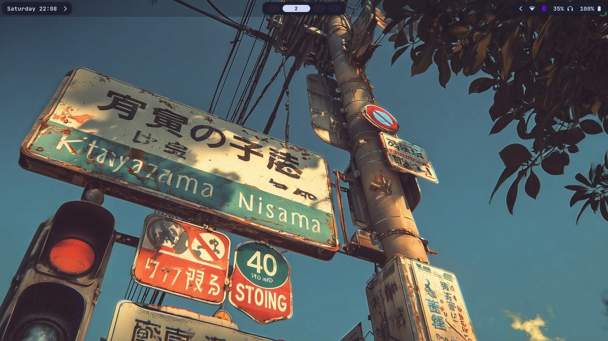
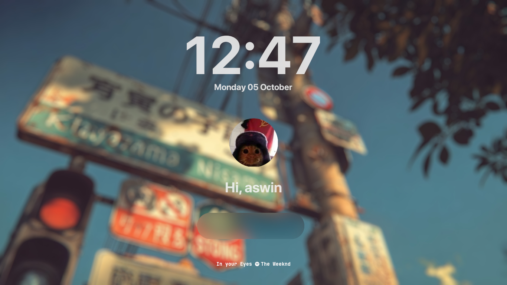

> 🚧 This repository is currently being organized. More configurations and scripts will be added soon.

# My Arch Linux Dotfiles

My personal Arch Linux desktop configuration built around **Hyprland**, with a focus on a minimal, modern, and lightweight workflow.


## 🖥️ Overview

This repository contains the configuration files, themes, and scripts I use for my daily Linux desktop.

### Current setup

* **OS:** Arch Linux
* **WM:** Hyprland
* **Status Bar:** Waybar
* **Terminal:** Kitty
* **Notifications:** Mako
* **Wallpaper:** awww
* **Launcher:** Rofi
* **Authentication:** polkit-gnome

## ✨ Features

* Minimal themed desktop
* Custom Hyprland keybindings
* Dynamic theme switching
* Custom Waybar themes
* Wallpaper switching with animated transitions
* Waybar toggle
* Custom startup configuration
* Lightweight system utilities and scripts

## 📁 Structure

```text
dotfiles/
├── hypr/
│   ├── hyprland.lua
│   └── hyprlock.conf
│
├── kitty/
├── mako/
│   └── config
├── themes/
│
├── screenshots/
│   ├── desktop.png
│   ├── face.png
│   ├── lock.jpg
│   └── wallpaper.jpg
│
├── scripts/
│   ├── theme-menu.sh
│   ├── switch-theme.sh
│   └── toggle-waybar.sh
│
├── waybar/
│
└── README.md
```

## 🎨 Theme System

The setup includes a simple theme-switching system.

Themes contain their own wallpaper and Waybar configuration:

```text
themes/
└── BetterArch/
    ├── wallpaper.jpg
    └── waybar/
        ├── config
        └── style.css
```

A Rofi-based menu can be used to select a theme, after which the corresponding wallpaper and Waybar configuration are applied.

## ⌨️ Keybindings

| Key         | Action              |
| ----------- | ------------------- |
| `Super + W` | Open theme selector |
| `Super`       | Toggle Waybar       |
| ...         | More coming soon    |

## 🚀 Installation

> Installation instructions will be added once the configuration is fully organized.

The general idea will be:

```bash
git clone https://github.com/<username>/dotfiles.git
cd dotfiles
./install.sh
```

## ⚠️ Notes

These configurations are designed for my personal Arch Linux + Hyprland setup.

They may require additional packages and some adjustments depending on your system.

**Do not blindly copy configuration files without checking the commands and paths first.**

## 📸 Preview
### Desktop

### Hyprlock (Lock Screen — Preview)


---

<!-- ## Credits

Some components of the themes in this repository are based on or adapted from work by other creators.

Waybar theme — Based on/adapted from Original Repository
LightDM theme — Based on/adapted from Original Repository

All original authors retain ownership of their respective work. Their licenses and attribution requirements apply to the corresponding files. -->

---

### License

Feel free to use, modify, and adapt anything from this repository for your own setup.
